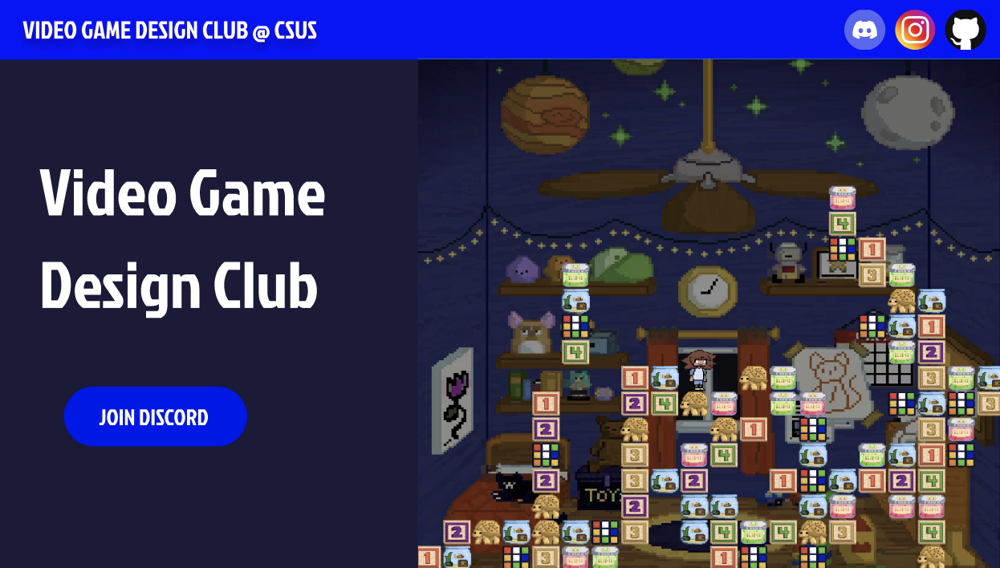

# Video Game Design Club

<link rel="stylesheet" href="src/readme-styles.css">

<b>[Status: In Development]</b>

A website for the Video Game Design Club at CSUS! 

The Video Game Design Club is a club at Sac State filled with passionate students learning to design and create video games. From complete beginners to the more experienced, members of the club get to learn and partake in the process of video game design. Artists, Musicians, Programmers, writers, and more combine their talents to contribute to current projects.

<!-- Join Discord Button -->
<!-- <a href="https://discord.gg/AZBXVctsvU" target="_blank" style="display: inline-block; background-color: #000AEE; color: white; text-align: center; padding: 15px 30px; text-decoration: none; border-radius: 4rem; font-size: 20px; margin: 20px; cursor: pointer; font-family: 'Jockey One'">JOIN DISCORD</a> -->

## Creation Process
As the sole developer for this project, I wanted to create a website that would be easy to navigate and visually appealing while maintaining the spirit of VGDC. 
1) <b>Planning:</b> Collaborating with the club president, I gathered information about the club and its members to create a website that would be informative and engaging. We discussed the layout, color scheme, and content that would be included on the website.
2) <b>Wireframe:</b> I started by creating a template for the website using [Figma](https://www.figma.com/file/LI6Q4u6401fMTQWcKTu3qJ/Video-Game-Design-Club?type=design&node-id=0%3A1&mode=design&t=AWG65BI3JjSkovnE-1)
 to plan out the layout and design of the website.
3) <b>Development:</b> I used Angular to create the website utilizing HTML, CSS, and JS. I used the wireframe as a guide to create the layout and design of the website.
4) <b>Hosting:</b> Currently in progress, but I plan to host the website on Netlify if there 

## Tech Stack
Programming & Scripting Languages: HTML, CSS, JS

Frontend Framework: Angular 

Runtime Environment: Node.js

Hosting: Netlify

Wireframe Template: [Figma](https://www.figma.com/file/LI6Q4u6401fMTQWcKTu3qJ/Video-Game-Design-Club?type=design&node-id=0%3A1&mode=design&t=AWG65BI3JjSkovnE-1)
